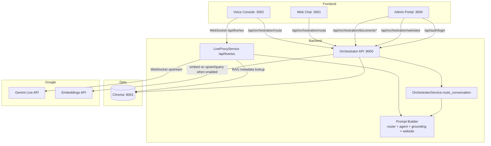
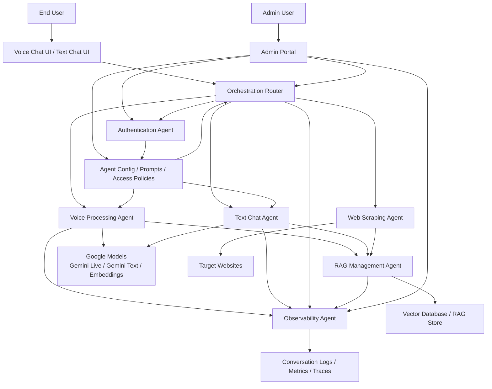
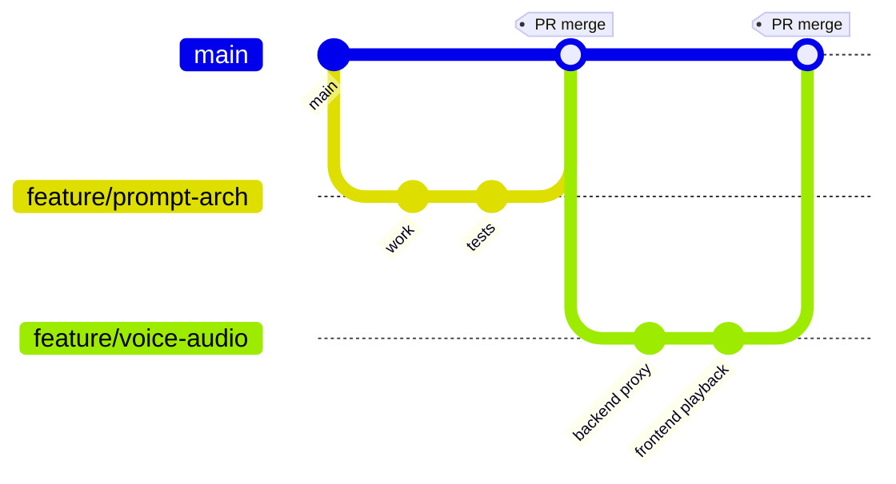

# IRA Project Overview

This file consolidates the most useful context from:

- [plan.md](file:///c:/Development/IRA/plan.md)
- [progress.md](file:///c:/Development/IRA/progress.md)
- [README.md](file:///c:/Development/IRA/README.md)

## Current Implementation (What Runs Locally)

- `apps/admin-portal` provisions a website and manages documents in the website knowledge base.
- `apps/web-chat` routes text requests through the orchestrator and displays the selected agent + prompt package.
- `apps/voice-console` prepares a voice route and connects to the backend Gemini Live proxy over WebSocket.
- `services/orchestrator` provides:
  - website provisioning
  - document upsert/query/list/delete
  - orchestration routing (`text_chat` vs `voice_processing`)
  - Gemini Live backend WebSocket proxy

## Current Runtime Diagram (What Exists Today)

## Target Multi-Agent Diagram (Planned)

This is the planned multi-agent architecture described in [plan.md](file:///c:/Development/IRA/plan.md#L82-L145).

## Git Workflow Diagram (For GitHub/Git)

This is a recommended Git flow for this repository that works well with a fast-moving monorepo.

## Roadmap Highlights

- Voice-to-voice UX: touch-first UI, realtime state animations, barge-in, streamed audio output.
- RAG: website crawl ingestion, chunking, retrieval evaluation, citations, and incremental refresh.
- Admin: onboarding that provisions crawl/RAG/agent/observability defaults per website.
- Observability: trace/metrics capture for routing, retrieval, model usage, and live session health.
