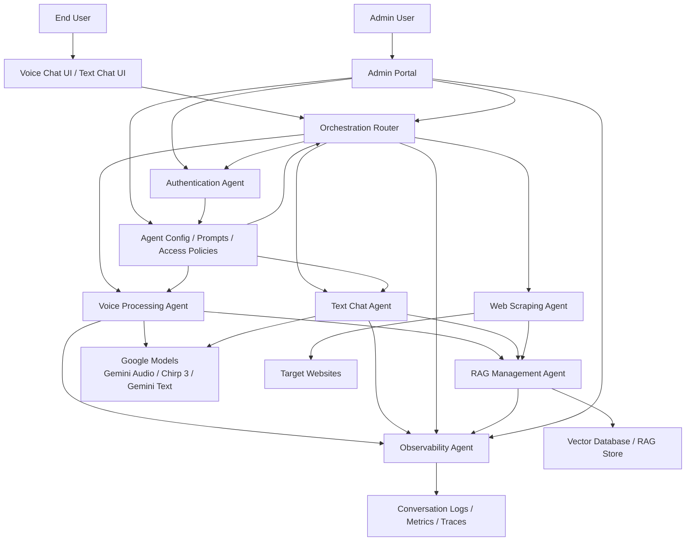

# Implementation Plan for IRA: Ultra-Fast Voice-to-Voice & Chat Bot Agent

## 1. Project Overview & Core Objectives
Develop an advanced AI agent named IRA that combines real-time voice-to-voice conversation, text-based chat functionality, and dynamic web crawling for knowledge base management. The system must deliver ultra-low latency interactions, support mixed-language conversations, and feature a responsive, touch-optimized user interface with voice-responsive animations. The implementation will use a modular, multi-agent orchestration architecture to ensure scalability, maintainability, and extensibility for future feature additions. Admin onboarding must allow a website to be configured from the admin UI and automatically provision the associated crawl settings, agent configuration, RAG index resources, and observability baselines without manual infrastructure work.

## 2. UI/UX Development Requirements
### 2.1 Full-Screen Voice Chat Interface
- Build a touch-screen optimized full-screen UI that supports all modern touch gestures (swipe, tap, pinch-to-zoom)
- Implement smooth, voice-responsive animations that sync with audio input/output:
  - Real-time waveform visualization during user speech input
  - Dynamic pulse animations during AI speech output that match audio cadence
  - Seamless transition animations between listening, processing, and speaking states
  - Microphone active/inactive state indicators with haptic feedback for touch devices
- Ensure full compatibility with touch-only devices (tablets, interactive kiosks) and traditional desktop/mobile inputs

### 2.2 Mobile-Responsive Text Chat UI
- Develop a mobile-first chat interface that maintains visual consistency with the voice chat UI
- Reuse the identical system prompt across both voice and text agents to ensure unified conversation logic and response quality
- Use a suitable Google Gemini text model for chat responses, prioritizing low-latency performance, strong instruction following, streaming output, and grounded RAG-constrained answers
- Implement responsive grid layouts that adapt to screen sizes from 360px (mobile) to 4K (large touch displays)
- Add support for message threading, read receipts, and conversation history persistence
- Ensure cross-platform consistency across iOS, Android, and desktop web browsers

## 3. Core AI & Language Processing Capabilities
### 3.1 Multilingual Voice-to-Voice System
- Use Google's Gemini Live API as the primary low-latency voice-to-voice runtime over stateful streaming sessions, authenticated with a user-provided Google API key and exposed through a configurable model-selection layer
- Use Chirp 3 Transcription for configurable speech recognition paths, including streaming ASR, automatic language detection, domain adaptation, diarization where needed, denoising, and endpointing sensitivity tuning
- Use native Gemini Live audio output and Chirp 3 HD voices as configurable speech output options for natural, expressive, multilingual voice responses
- Implement automatic language detection that supports real-time switching during mixed-language conversations (e.g., a user switching from English to Spanish mid-sentence without explicit input)
- Support for 70+ conversation languages where available in the selected Google runtime, with accent-aware recognition and pronunciation adaptation
- Add real-time translation capabilities for cross-language conversations while maintaining natural conversational flow
- Use streaming speech input/output pipelines with barge-in support so the assistant can begin responding within milliseconds and can be interrupted naturally during live conversations

### 3.2 Real-Time Session Runtime & Tooling
- Build the primary real-time voice path on persistent streaming sessions, with backend-mediated session control as the default deployment model and browser-safe token flows where direct client streaming is required
- Support real-time transcripts for both user speech and model speech, unified session state across voice and text, and deterministic handoff between voice mode and text mode
- Expose controlled function calling and tool usage during live sessions so the orchestration router can invoke RAG retrieval, admin-configured actions, and domain tools without breaking conversational flow
- Add session-level policies for turn detection, interruption handling, retry strategy, latency budgets, and fallback from voice to text when audio services degrade

### 3.3 RAG & Context Management
- Select and implement a modern, high-performance RAG (Retrieval-Augmented Generation) pipeline optimized for web-crawled content, with vector storage using Pinecone or Chroma for low-latency context retrieval
- Use hybrid retrieval with semantic search, lexical search, and reranking to improve grounding quality for organization-specific content
- Implement incremental RAG memory updates to avoid full re-indexing when website content is modified, reducing computational overhead
- Restrict all agent responses exclusively to information contained within the organization's configured RAG knowledge base, with a standardized fallback response for out-of-scope queries
- Add context window management to ensure optimal performance while maintaining conversation history relevance
- Auto-provision a per-website knowledge namespace, default crawl policy, prompt template, and retrieval configuration when an admin registers a new website in the portal
- Include citation tracing and retrieval evaluation metrics so admins can inspect which documents grounded each response
- Capture per-conversation observability metadata including retrieved documents, latency, model selection, tool usage, token consumption, and structured reasoning summaries for admin review without storing raw private chain-of-thought

## 4. Admin Portal & Web Crawler Functionality
### 4.1 Secure Authentication System
- Build an admin authentication layer with initial simple password-based login, designed with an extensible architecture to support future integration with Active Directory (AD), OAuth 2.0, SAML 2.0, and other enterprise identity providers
- Implement role-based access control (RBAC) that restricts users to manage only the websites assigned to their account, including RAG memory renewal permissions
- Add session management, brute-force attack protection, and audit logging for all admin actions

### 4.2 Integrated Web Crawler
- Develop a web crawler module within the admin UI that allows authenticated users to input a target website URL and initiate crawling
- Implement crawler configuration options: page depth limits, domain restriction to prevent off-site crawling, file type filters, and crawl scheduling
- Store all crawled content in the RAG vector database, with automatic content parsing, cleaning, and chunking optimized for LLM retrieval
- Add a dashboard to view crawl status, indexed page counts, and last update timestamps for all configured websites

### 4.3 Agent Configuration & RAG Management
- Enable admins to create and configure custom IRA agents for each crawled website, with unique system prompt overrides if needed (while maintaining core system prompt consistency)
- Allow admins and environment configuration to select which Google model is used for voice and text workloads, so model choices can be changed without code changes
- Implement a one-click RAG memory renewal feature that allows authorized users to re-crawl and re-index a single assigned website, with delta updates to minimize processing time
- Add version control for RAG indexes to roll back to previous versions if new crawls introduce errors or outdated content

### 4.4 Admin Onboarding & Auto-Configuration
- After admin login, provide a guided setup flow where the admin enters the website URL, display name, crawl scope, and optional prompt overrides, and the platform provisions the rest automatically
- Automatically create the website record, crawl job, vector namespace, retrieval defaults, agent profile, observability dashboard bindings, and health checks from admin UI inputs
- Pre-populate recommended defaults for crawl depth, allowed domains, language hints, model selections, and guardrails, while still allowing admins to override settings
- Run validation checks before activation, including website reachability, robots and policy validation, crawl preview, chunking preview, and retrieval smoke tests
- Store configuration changes as versioned records so admins can audit, compare, roll back, and reapply working configurations
### 4.5 Conversation Monitoring & Observability
- Add an admin UI feature to monitor live and historical voice/text conversations, with filters by website, agent, user session, date range, language, and error state
- Show per-conversation observability metrics including prompt/completion/total token usage, model name, latency per stage, tool calls, retrieval events, fallback events, and error traces
- Provide a safe reasoning inspection view using structured reasoning summaries, decision logs, and citation traces instead of storing or exposing raw chain-of-thought
- Include transcript and message timeline views for both text and voice sessions, with playback references for audio interactions where available
- Add alerting and anomaly detection for unusual token spikes, latency regressions, repeated fallback responses, crawler/index issues, and model errors
- Enforce RBAC and audit logging on all observability and conversation review features to protect sensitive user and operational data

## 5. Multi-Agent Orchestration Architecture
Implement a modular multi-agent orchestration layer that manages discrete, scalable agents for each core system function:
- **Voice Processing Agent**: Manages Google voice model integration, real-time speech-to-text and text-to-speech conversion, and language detection
- **Text Chat Agent**: Handles text-based user inputs, maintains conversation context, and generates consistent responses aligned with the system prompt
- **Web Scraping Agent**: Manages distributed crawling, content parsing, and preprocessing for RAG integration, with rate limiting to avoid target website blocks
- **Orchestration Router**: Routes user requests to the appropriate agent, synchronizes state across all modules, and manages cross-agent communication
- **RAG Management Agent**: Handles vector database operations, context retrieval, memory updates, and knowledge base consistency checks
- **Authentication Agent**: Centralizes all identity and access management functions, with a plugin architecture for future identity provider integrations
- **Observability Agent**: Collects chat transcripts, token usage, latency metrics, retrieval traces, tool events, and structured reasoning summaries for secure admin monitoring and debugging

### 5.1 Multi-Agent Orchestration Diagram

This diagram shows how end-user voice and text requests flow through the orchestration router, how the router coordinates specialized agents, and how the admin portal controls authentication, crawler operations, and model/prompt configuration.

## 6. Technology Stack & Configurability
- **Voice Runtime**: Google Gemini Live API as the primary real-time voice session layer, with configurable fallback and augmentation using Chirp 3 Transcription and Chirp 3 HD voices
- **Text Chat Model**: Google Gemini 2.5 Flash or the current low-latency Gemini successor as the primary default for fast text chat responses, with the exact model configurable via environment variables or admin settings
- **LLM Backend**: Google Gemini APIs as the default backend for both voice and text agents, authenticated using a user-provided Google API key stored in local Docker environment configuration for development and secret management for higher environments
- **Vector Database**: Chroma (primary for local Docker development) or Pinecone for RAG storage, with database credentials configurable via environment variables
- **Frontend Framework**: React 18 with TypeScript, Tailwind CSS for styling, and Framer Motion for voice-responsive animations
- **Backend Framework**: Node.js with Express, or Python with FastAPI for high-performance API handling
- **Crawler**: Puppeteer for dynamic content crawling, with Cheerio for static page parsing
- **Observability Stack**: OpenTelemetry instrumentation with an OTEL Collector, traces in Tempo or Jaeger, metrics in Prometheus, dashboards in Grafana, and structured logs in Loki or OpenSearch, plus per-conversation analytics storage for token usage, latency, retrieval events, and admin monitoring
- **Local Development Infrastructure**: Run the full development stack locally with Docker Compose, including frontend, backend, crawler, vector database, and supporting services

### 6.1 Repository & Folder Structure Standards
- Use a monorepo layout with clear separation between applications, backend services, shared packages, infrastructure, documentation, and tests
- **apps/**: `apps/web-chat`, `apps/voice-console`, `apps/admin-portal`
- **services/**: `services/api-gateway`, `services/orchestrator`, `services/voice-runtime`, `services/chat-runtime`, `services/rag-service`, `services/crawler`, `services/auth-service`, `services/observability-service`
- **packages/**: `packages/shared-types`, `packages/shared-config`, `packages/ui`, `packages/agents-sdk`, `packages/testing`, `packages/eslint-config`, `packages/tsconfig`
- **infra/**: `infra/docker`, `infra/compose`, `infra/otel`, `infra/scripts`, `infra/env`
- **docs/**: architecture diagrams, ADRs, API contracts, runbooks, security notes, deployment guides
- **tests/**: `tests/unit`, `tests/integration`, `tests/e2e`, `tests/performance`
- **root files**: `README.md`, `plan.md`, `progress.md`, `.env.example`, `docker-compose.yml`

### 6.2 Clean Code & Engineering Standards
- Apply clean architecture boundaries so UI, orchestration, domain logic, integrations, and infrastructure concerns remain isolated and testable
- Define stable contracts between services using typed DTOs, shared schemas, API versioning, and event payload validation
- Enforce linting, formatting, type checking, unit tests, integration tests, and architectural decision records as part of CI
- Prefer small focused services, explicit interfaces, configuration-driven behavior, and low-coupling shared libraries over duplicated business logic
- Design for p95 and p99 latency visibility, graceful degradation, retry controls, idempotency, and failure isolation across all agent workflows

## 7. Implementation Timeline & Milestones
### Phase 1 (Weeks 1-4): Core Infrastructure & UI
- Set up project repository, CI/CD pipeline, and local Docker-based development environment
- Establish the monorepo folder structure, clean code standards, and root-level `progress.md` project tracking
- Develop and test full-screen voice chat UI with touch support and basic animations
- Implement admin authentication system with initial password login
- Integrate Gemini Live API and Chirp 3 services for foundational real-time voice-to-voice interactions with streaming support

### Phase 2 (Weeks 5-8): Multilingual Support & RAG Foundation
- Implement automatic language detection and mixed-language conversation support
- Build core RAG pipeline with vector database integration
- Develop basic web crawler and admin interface for website configuration
- Launch mobile-responsive text chat UI with shared system prompt implementation using a Google Gemini text model optimized for low-latency responses

### Phase 3 (Weeks 9-12): Multi-Agent Orchestration & Advanced Features
- Deploy multi-agent orchestration layer to coordinate all system modules
- Implement RAG memory renewal and incremental update features
- Add enterprise authentication extension points (AD/OAuth readiness)
- Implement admin guided onboarding that automatically provisions website-specific crawl, RAG, agent, and observability configuration
- Build the admin conversation monitoring and observability dashboard with transcript review, token usage analytics, and structured reasoning summaries
- Conduct end-to-end testing of mixed-language conversations and crawl functionality

### Phase 4 (Weeks 13-14): Optimization & Launch Preparation
- Optimize the voice pipeline to achieve millisecond-level responsiveness, targeting sub-300ms response initiation and sub-800ms first-audio playback for seamless conversations
- Conduct security audit and penetration testing of admin portal
- Finalize documentation and user training materials
- Prepare for production deployment with monitoring and logging setup

## 8. Success Criteria & Quality Standards
- Voice interaction response initiation <300 milliseconds from user speech end to AI stream start, with first audio playback <800 milliseconds
- 95%+ accuracy in language detection for mixed-language conversations
- 100% mobile responsiveness across all supported screen sizes
- Touch UI error rate <1% on tablet and kiosk devices
- RAG context retrieval accuracy >90% for organization-specific queries
- 100% of conversations captured with searchable observability metadata including token usage, latency, model, and retrieval trace events
- 100% of admin-configured websites provision their crawl, retrieval, agent, and observability defaults automatically from the admin UI without manual operations steps
- Admin portal scalability to support 1000+ concurrent users and 500+ crawled websites
- System uptime >99.9% in production, with comprehensive error logging and alerting

## 9. Deliverables
- Production-ready IRA web application with voice and text chat functionality
- Admin portal with web crawler, agent configuration, and RAG management tools
- Admin observability dashboard with conversation monitoring, token analytics, trace inspection, and structured reasoning summaries
- Industry-standard monorepo folder structure and clean-code engineering baseline documented in the repository
- Complete technical documentation including architecture diagrams, API specs, and deployment guides
- Test suite with unit, integration, and end-to-end tests covering all core functionalities
- Root-level `progress.md` maintained throughout implementation to capture milestone progress, decisions, and status updates
- This implementation plan document with regular updates throughout the project lifecycle
